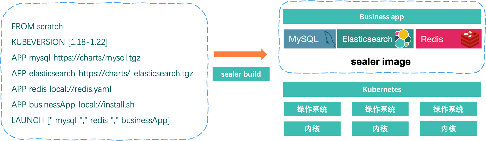
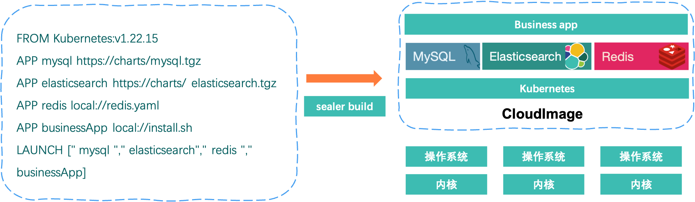

# Sealer Image

## What is Sealer Image?

A `Sealer Image` is a read-only file with all dependencies that needed to run a cluster and distributed applications.
Just like OCI Image, an image is often based on another image, with some additional customization.
In fact, the format of sealer image is also fully compliant with the [OCI specification](https://github.com/opencontainers).

## Application Image

An `Sealer Image` that does not contain Kubernetes and other KxS runtimes.



### How to build an application image

Kubefile:

```
FROM scratch
APP mysql https://charts/mysql.tgz
APP elasticsearch https://charts/ elasticsearch.tgz
APP redis local://redis.yaml
APP businessApp local://install.sh
LAUNCH [" mysql "," redis "," businessApp]
```

build command:

> NOTE: --type=kube-installer is the default value for sealer build

```
sealer build -f Kubefile -t my-app:1.0.0 --type=app-installer .
```

## Cluster Image

An `Sealer Image` that contains Kubernetes or other KxS runtimes.



### How to build an cluster image

Kubefile:

```
FROM docker.io/sealerio/kubernetes:v1.22.15
APP mysql https://charts/mysql.tgz
APP elasticsearch https://charts/ elasticsearch.tgz
APP redis local://redis.yaml
APP businessApp local://install.sh
LAUNCH [" mysql "," elasticsearch"," redis "," businessApp]
```

build command:

> NOTE: --type=kube-installer is the default value for sealer build

```
sealer build -f Kubefile -t my-kubernetes:1.0.0 .
```
