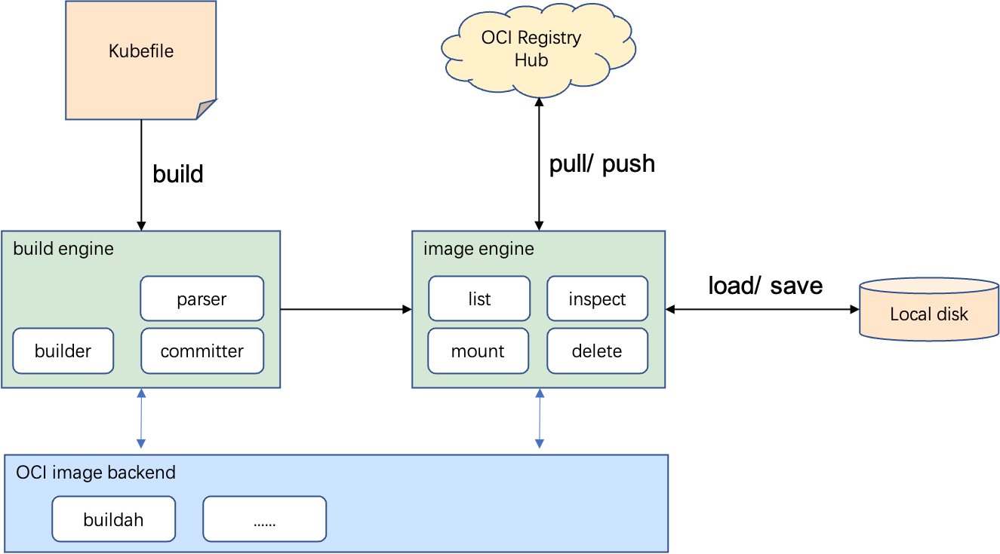

# Architecture

Sealer has two top module: Image Module & Cluster Module

The Image module using Kubefile and build context as input, and build a Sealer Image that contains all the dependencies.

The Cluster module implements the desired state of cluster through Clusterfile and Sealer Image.

## Image module

### Build Engine

* parser : parse Kubefile into Dockerfile.
* builder : execute each build instruction and save its asset.
* committer : commit Sealer Image to image engine.

### Image Engine

Provides a common interface to the Sealer Image, such as list,delete,mount,inspect and the interaction with the local
disk and the remote registry hub.

## Cluster module

* common user interface: provides a common user interface to launch Sealer Image through sealer CLI or Clusterfile.
* image preprocessor: implement content distribution and modification through config or env render for the Sealer Image.
* cluster runtime: cluster installer implementation, like using kubeadm to install or upgrade k8s cluster.
* plugin : implements the maintenance of hosts and the modification of the cluster at different process phase.
